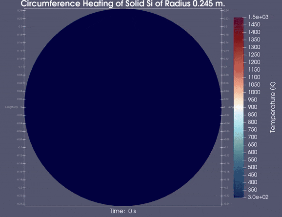

CAMEL : Czochralski Apparatus for Modeling Efficient Lattice growth
=====

## Introduction ##
The Czochralski (Cz) process is a method of growing single crystal ingots most commonly used for semiconductors such as silicon. This process is widely used commercially and thus further research 
has significant financial incentives. 
 
The aim of this project is to develop a multiscale, multiphysics model for the Czochralski process. The multiphysics simulations will include heat transfer, phase field methods, and computational fluid dynamics utilizing the Navier-Stokes equations, among other physics capabilities.
  
This project is made possible by the development of [The Multiphysics Object-Oriented Simulation Environment (MOOSE)](https://github.com/idaholab/moose)

## Recent Progress ##
### Moose Material Object - ShomateHeatConductionMaterial ###

   </img>

Moose Material Object created for heat conduction simulations involving variable heat capacity based on the <b>Shomate Equation</b>. 

  $$C_p = A + B \cdot T + C \cdot T^2 + D \cdot T^3 + E \cdot 1/T^2 $$
  The rendered simulation above calculates the temperature gradient for a solid block of Si with $C_p$ calculated using the shomate equation and thermal conductivity ($k$) calculated using a piecewise linear function with experimentally measured data. 

## To Do ##

  <ol>
    <li>CFD simulation for Si melt ($T > 1687$ K)</li>
    <li>Single crystal growth for Si using Phase-Field physics module</li>
  </ol>

Fork "CAMEL" to create a new MOOSE-based application.

For more information see: [https://mooseframework.org/getting_started/new_users.html#create-an-app](https://mooseframework.org/getting_started/new_users.html#create-an-app)
